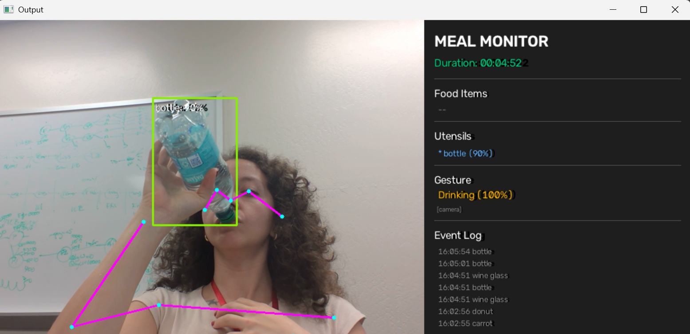
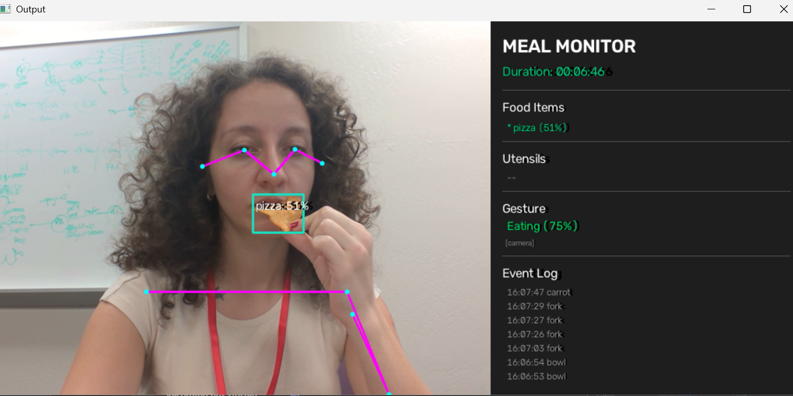
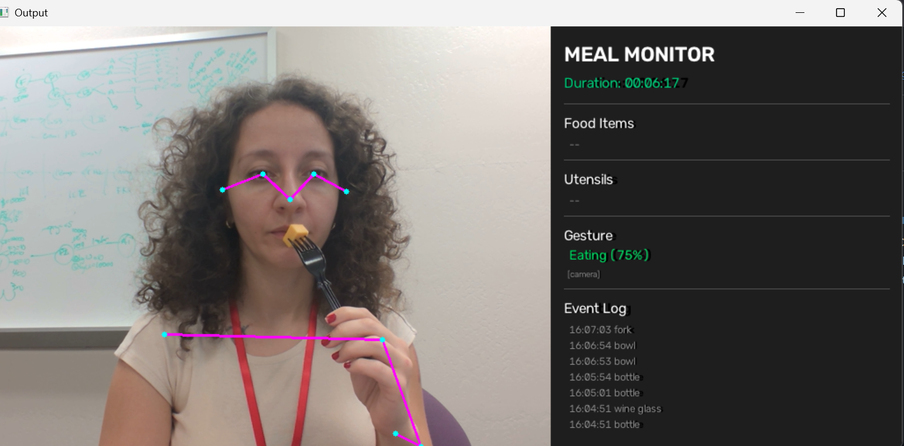

<p align="center">
  
</p>

<h1 align="center">Bite Counter</h1>

<p align="center">
  Real-time meal monitoring with dual AI models on the Hailo-8 accelerator
</p>

<p align="center">
  
  
  
  
  
</p>

---

Detects food, utensils, and drinks using **YOLOv8m** while simultaneously tracking body pose with **YOLOv8s_pose** to classify eating gestures — both models running on a single Hailo-8 chip via round-robin scheduling.

## Demo

| Eating | Drinking | Utensil Detection |
|:---:|:---:|:---:|
|  |  |  |
| Pizza detected, gesture: **Eating (75%)** | Bottle detected, gesture: **Drinking (100%)** | Fork detected, gesture: **Eating (75%)** |

## Features

- **Dual-model inference** on a single Hailo-8 chip (26 TOPS)
- **Food detection** — pizza, sandwich, banana, apple, and 6 more COCO food classes
- **Utensil tracking** — fork, knife, spoon, bowl, bottle, cup, wine glass
- **Gesture classification** — Eating, Drinking, Reaching, Resting from pose keypoints
- **Live dashboard** — real-time stats, event log, duration timer
- **Skeleton overlay** — 17-keypoint body pose drawn on camera feed
- **One-command setup** — `setup.bat` handles everything

## Hardware Requirements

| Component | Details |
|---|---|
|  | M.2 M-Key AI accelerator (26 TOPS, PCIe Gen3 x4) |
|  | M.2 to Thunderbolt PCIe enclosure |
|  | Laptop with Thunderbolt 3 or 4 port |
|  | USB or integrated webcam |

## Quick Start

### 1. Install HailoRT

Download from the [Hailo Developer Zone](https://hailo.ai/developer-zone/):

- **HailoRT Windows installer** (`.exe`) — PCIe driver + runtime
- **HailoRT Python wheel** (`.whl`) — Python bindings

Verify:
```cmd
hailortcli fw-control identify
```

### 2. Clone and Setup

```cmd
git clone https://github.com/MicrochipTech/Bite-Counter.git
cd Bite-Counter
setup.bat
```

Then install the HailoRT Python wheel into the venv. The wheel **must match** both your HailoRT runtime version and your Python version:
```cmd
venv\Scripts\activate
pip install path\to\hailort-X.XX.X-cpXXX-cpXXX-win_amd64.whl
```

> **Example:** HailoRT 4.24.0 + Python 3.12 → `hailort-4.24.0-cp312-cp312-win_amd64.whl`

Verify:
```cmd
python -c "from hailo_platform import VDevice; print('HailoRT OK')"
```

### 3. Run

```cmd
run.bat
```

AI models (~40 MB) download automatically on first run. Press **Q** to quit.

## What You'll See

<p align="center">
  
</p>

**Left panel** — Live camera feed with bounding boxes on food/utensils and skeleton overlay on detected person.

**Right panel** — Dashboard with meal duration, detected items, current gesture, and event log.

## Command Line Options

| Flag | Default | Description |
|------|---------|-------------|
| `-n` | `yolov8m` | Object detection model |
| `-i` | — | Input source (`usb` for webcam, or video file path) |
| `--show-fps` | off | Display frame rate in terminal |
| `--pose-model` | `yolov8s_pose` | Pose estimation model |
| `--no-gesture` | off | Single-model mode for higher FPS (~25 vs ~12) |
| `--dashboard-width` | `400` | Dashboard panel width in pixels |

## How It Works

```
                        ┌─────────────┐
                        │  USB Camera │
                        └──────┬──────┘
                               │
                        ┌──────▼──────┐
                        │  Preprocess │  resize to 640x640
                        └──────┬──────┘
                               │
              ┌────────────────┼────────────────┐
              │                                 │
     ┌────────▼────────┐             ┌──────────▼──────────┐
     │    YOLOv8m      │             │   YOLOv8s_pose      │
     │  Object Detect  │             │  Pose Estimation    │
     └────────┬────────┘             └──────────┬──────────┘
              │                                 │
     ┌────────▼────────┐             ┌──────────▼──────────┐
     │   BYTETracker   │             │ Gesture Classifier  │
     │  Food/Utensils  │             │  3-Signal Voting    │
     └────────┬────────┘             └──────────┬──────────┘
              │                                 │
              └────────────────┬────────────────┘
                               │
                     ┌─────────▼─────────┐
                     │  Meal State +     │
                     │  Dashboard Render │
                     └─────────┬─────────┘
                               │
                        ┌──────▼──────┐
                        │   Display   │
                        └─────────────┘
```

Both models share the Hailo-8 chip via a single virtual device with `ROUND_ROBIN` scheduling. No GStreamer required.

### Gesture Classification

Three independent signals are evaluated per frame:

| Signal | What it checks | Weight |
|--------|---------------|--------|
| **Wrist near face** | Either wrist within 2.5x head-width of nose | 2x |
| **Bent elbow** | Shoulder-elbow-wrist angle < 130 degrees | 1x |
| **Raised wrist** | Either wrist above shoulder level | 1x |

| Signals | + Drink detected? | Result |
|---------|-------------------|--------|
| 2+ of 3 | No | **Eating** |
| 2+ of 3 | Yes (bottle/cup/glass) | **Drinking** |
| Raised + bent only | — | **Reaching** |
| Both wrists below, still 10+ frames | — | **Resting** |

### Object Detection Classes

| Category | COCO IDs | Items |
|----------|----------|-------|
| **Food** | 46-55 | banana, apple, sandwich, orange, broccoli, carrot, hot dog, pizza, donut, cake |
| **Utensils** | 42-45, 60 | fork, knife, spoon, bowl, dining table |
| **Drinks** | 39-41 | bottle, wine glass, cup |

## Project Structure

```
Bite-Counter/
├── README.md
├── setup.bat                 # One-command Windows setup
├── run.bat                   # One-click launcher
├── config.json               # Score threshold, tracker config
├── requirements.txt
├── src/
│   ├── meal_monitoring.py              # Main entry — dual HailoInfer, inference thread
│   ├── meal_monitoring_post_process.py # OD + pose processing, skeleton drawing
│   ├── meal_state.py                   # State tracking, event log
│   ├── dashboard_renderer.py           # OpenCV dashboard panel
│   ├── gesture_classifier.py           # 3-signal voting classifier
│   └── pose_utils.py                   # Pose post-processing wrapper
├── docs/
│   ├── architecture.md                 # Detailed technical architecture
│   ├── conversation_log.md             # Development log
│   └── images/
│       ├── eating.png
│       ├── drinking.png
│       └── utensil.png
└── .claude/
    └── skills/setup/SKILL.md           # Interactive setup skill for Claude Code
```

## Troubleshooting

| Problem | Solution |
|---------|----------|
| `No Hailo device found` | Check enclosure power, authorize Thunderbolt in Windows Settings, reconnect cable |
| `DLL load failed ... _pyhailort` | HailoRT wheel version doesn't match installed runtime. Reinstall the `.whl` that matches your HailoRT version (check with `hailortcli fw-control identify`) and Python version (`python --version`) |
| `HAILO_OUT_OF_PHYSICAL_DEVICES` | Another process is using the Hailo chip. Close any other Hailo app or Python process, then retry |
| Camera doesn't open | Close other apps using webcam (Teams, Zoom). Try `-i 1` for alternate camera |
| `ModuleNotFoundError: hailo_platform` | Activate venv, reinstall the HailoRT `.whl` matching your runtime + Python version |
| `ModuleNotFoundError: hailo_apps` | Check `PYTHONPATH` points to `deps\hailo-apps`, or re-run `setup.bat` |
| Models not downloading | Check internet. Place `.hef` files manually in `C:\usr\local\hailo\resources\models\hailo8\` |
| Gesture stuck on Resting | Ensure pose model loaded (check logs). Move hand clearly to face with bent elbow |
| Very low FPS (< 5) | Close other apps. Verify Thunderbolt connection (not USB fallback). Try `--no-gesture` |

## Performance

| Mode | FPS | Models |
|------|-----|--------|
| Dual model (default) | ~10-15 | YOLOv8m + YOLOv8s_pose |
| Single model (`--no-gesture`) | ~20-25 | YOLOv8m only |

## Built With

- [Hailo-8](https://hailo.ai/) — 26 TOPS AI accelerator
- [hailo-apps](https://github.com/hailo-ai/hailo-apps) — Application framework (HailoInfer, BYTETracker, toolbox)
- [YOLOv8](https://docs.ultralytics.com/) — Object detection and pose estimation models
- [OpenCV](https://opencv.org/) — Camera capture and rendering

## License

This project uses the [hailo-apps](https://github.com/hailo-ai/hailo-apps) framework. See its repository for license terms.
